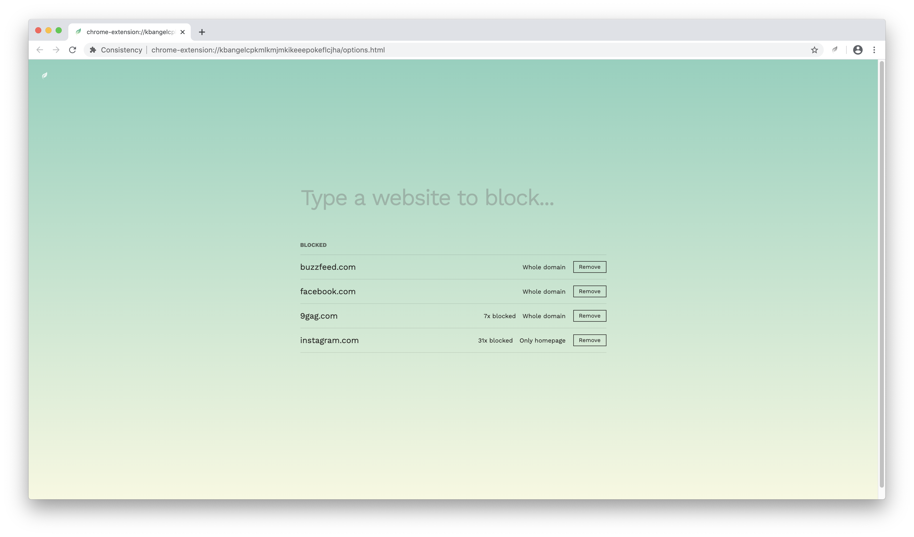

# Consistency

Consistency is a simple and beautiful [Chrome extension](https://chrome.google.com/webstore/detail/consistency/lnlkeagaboibogkmlokbhmjhdglokgdn) that helps you build your habits by blocking websites you don't want to visit. Inspired by James Clear's book Atomic Habits, words from the book appear when you get tempted to visit a blocked page.

## How to dev

In Chrome Extensions list, enable developer mode, and use "Load unpacked" to load content of this repository.
